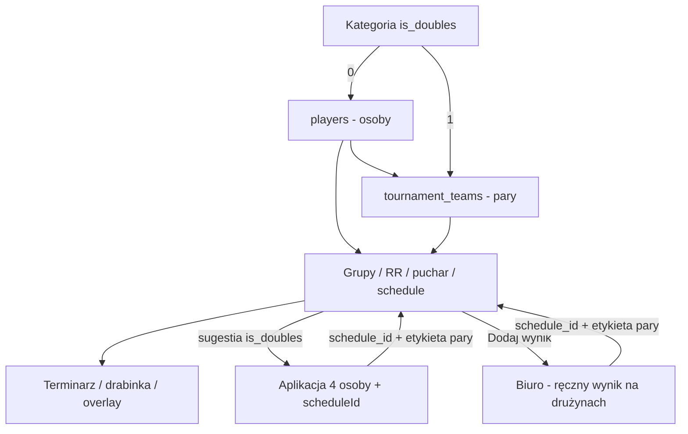

# Debel, format rozgrywek i tłumaczenia — plan implementacji

> [!info] Status (2026-08-13)
> Plan zatwierdzony do realizacji. Branch roboczy: `cursor/doubles-office-040b` (z `feature/doubles-office`). Środowisko testowe: https://test.blindtennis.app (dell, osobny compose/volume — nie prod).  
> **Etap 0 (fundament) zaimplementowany:** `is_doubles`, `play_format`, `tournament_teams`, `team_id` na grupie, CRUD par, `format_team_display_name` / `normalize_pair_key`, testy `test_tournament_teams.py`.  
> **Etap 1 (UI biura) zaimplementowany:** checkbox Double, badge Debel, pary (CRUD + DnD), dropdown trybu na karcie grupy, kompletność kroku 1 osobno dla par, dropdown terminarza z drużynami, analog w adminie, i18n pl/de/en/it/es/fr.  
> **Etap 1b (pipeline trybu) zaimplementowany:** `ensure_group_schedule_entries` pomija `knockout`; auto-KO liczy kompletność per grupa / para A+B (nie czeka na cały turniej); `round_robin` bez pucharu; `knockout` z puli członków bez RR (drabinka 2/4/8); krzyż 1A–2B tylko gdy obie grupy kubełka są `groups_knockout`; samotny `groups_knockout` z tabeli (top 4 → finał+3. miejsce); postęp biura; publiczna drabinka ukrywa tabelę RR dla `knockout`. Testy: `test_group_play_format.py`, `test_knockout_generation.py`, lifecycle.  
> **Etap 2 (ręczny wynik debla) zaimplementowany:** modal A/B = drużyny grupy double; prefill ze schedule zostawia nazwy par + `schedule_id`; walkower na drużynach; `officeAllPlayerNames` nie dokleja osób do formularza debla; korekta zostawia nazwy par; standings/KO exact nazwa drużyny (bez surname-token z `"A / B"`); 409 gdy slot ma już mecz; analog etykiet w adminie. Testy: `test_office_doubles_result.py`.  
> **Etap 3 (most aplikacji):** backend w `wyniki-live` (`is_doubles` + `partner`, matching bez kolejności partnerów). Aplikacja w `Umpire-App`: `ScheduleSuggestion.isDoubles`, selector 4 osób, `applySuggestedMatch` nie czyści `scheduleId` przy Debel z sugestii, `team1Name`/`team2Name` z planu.  
> **Etap 4 (wyświetlanie par) zaimplementowany:** łamanie etykiet `"A / B"`, search po obu nazwiskach, flagi partnera na live, overlay zostawia `/`.  
> **Etap 6 (i18n + LT) zaimplementowany:** `lt` + `lt-LT`, pełne katalogi publiczna/biuro, select Lietuvių, `?lang=lt`, audyt zawodnik→para, Android `values-lt`. Notatka: [[43 - Debel - audyt i18n]].  
> **Gate: testy jednostkowe + E2E na wszystko z tego planu (Etap 7).**

Powiązane w tym vaultcie: [[25 - Planowanie - grupy]] · [[26 - Planowanie - terminarz i autoschedule]] · [[27 - Wprowadzanie i edycja wyniku]] · [[24 - Puchar]] · [[12 - Drabinka]] · [[13 - Terminarz]] · [[18 - Język, motyw, access_key]] · [[33 - Plan turnieju]] · [[36 - Gracze turnieju i import]] · [[43 - Debel - audyt i18n]]

Poza tym vaultem (aplikacja): `android-tennis-referee/docs/Referencje/32 - Singiel vs debel.md`, `14 - Wybór zawodników.md`, `DOUBLES_SUPPORT.md`.

---

## Cel

Kategoria turnieju może być **deblem**. Wtedy **2 osoby = 1 konkurent** (drużyna). Grupy, round-robin, rewanże, puchar, autoschedule i terminarz liczą drużyny tak samo jak dziś liczą zawodników.

Sędzia na korcie dostaje z planu podpowiedź debla (4 osoby + `scheduleId`). Jeśli mecz **nie idzie z aplikacji**, biuro wprowadza wynik ręcznie na **drużynach**, nie na osobach.

Osobno (poza deblem, ale w tym samym wdrożeniu): **każda grupa** ma tryb rozgrywek wybierany przy tworzeniu/edycji (dropdown, default **grupy + puchar**). Każdy nowy napis UI idzie we **wszystkich językach**; dokładamy **litewski** i audytujemy istniejące tłumaczenia w kontekście tenisa, nie 1:1.

---

## Decyzja produktowa

| Zasada | Szczegół |
|--------|----------|
| Checkbox **Double** przy tworzeniu kategorii (presety B1–B4 K/M i custom) | Flaga na kategorii, nie na meczu |
| Drużyna = 1 wiersz w grupie | RR, puchar, plan — bez zmiany algorytmu |
| `players` zostaje listą **osób** | Aplikacja potrzebuje 4 prawdziwych graczy i rotacji serwisu |
| Ta sama osoba może grać singla **i** debla | Osobne kategorie, osobne grupy |
| Mikst B3/4 (hint_bands) ≠ mixed doubles | Mixed doubles w appce nadal z płci M+K w obu parach |
| Kanoniczna etykieta pary | `"Imię Nazwisko / Imię Nazwisko"` — ten sam format co aplikacja |
| **Format rozgrywek na grupie** | Dropdown na karcie grupy przy tworzeniu/edycji. Default: **grupy + puchar**. Nie na kategorii. Double zostaje checkboxem kategorii. |
| **i18n** | Nowy string = wszystkie języki od razu; litewski jako 7. język; audyt kontekstowy, nie kalka |
| **Testy** | Każdy etap ma unit. Całość zamyka **Etap 7**: pytest + E2E biura/publicznej + E2E Androida. Bez zielonej macierzy nie ma merge na produkcję. |

> [!warning] Nie wrzucać drużyn do tabeli `players`
> Fałszywy rekord `"Kowalski / Nowak"` zepsuje listę w aplikacji, flagi, profile i statystyki. Osoby i pary to dwa byty.

---

## Stan obecny (audit 2026-08-13)

### Aplikacja — debel jest

- Checkbox **Debel**, 4 graczy, rotacja 1→2→3→4, mikst z płci.
- Na API idzie nazwa drużyny: `"Anna Kowalska / Ewa Nowak"` (`MatchApiPayloadFactory`, `getTeam1FullName()`).
- Winner / walkover / retirement też jako nazwa pary.
- Kolejność slotów: wybrani `[0,1]` = drużyna 1 (`player1`+`player3`), `[2,3]` = drużyna 2 (`player2`+`player4`) — `NextMatchController`.

### Biuro / backend — debla w planie nie ma

- `tournament_categories`: `label`, `preset_key`, `hint_bands` — **brak `is_doubles`**.
- Grupy: `bracket_group_players (player_id, player_name)` — osoby.
- Terminarz i drabinka: dwa stringi `player1_name` / `player2_name`.
- RR kopiuje `player_name` z grupy 1:1 (`_insert_group_round_robin_schedule_entries`).
- Ręczny wynik: dropdown **Zawodnik A/B** z osób w grupie (`officeAllPlayerNames` + `group.players`).

### Strona publiczna — tekstowo „jako tako”

- Terminarz, drabinka, overlay renderują stringi. `"A / B vs C / D"` się pokaże.
- Overlay już nie nadpisuje etykiety z `/` pojedynczym nazwiskiem z eventu (`_resolve_live_player_name`).
- Słabe: flagi (lookup po nazwie drużyny), `resolveBracketName` (ostatni token = drugi partner), wyszukiwarka, długie etykiety w kartach.

### Trzy pytania — odpowiedzi

| Pytanie | Dziś | Po wdrożeniu |
|---------|------|----------------|
| Czy appka bierze Double ze schedule? | **Nie.** Sugestia nie ma `is_doubles`. **Użyj meczu** wymusza singla (2 osoby). Checkbox Debel **czyści `scheduleId`**. | Sugestia niesie `is_doubles` + 4 osoby. Użycie **nie czyści** `scheduleId`. |
| Czy debel z appki dopasuje się do planu? | **Tylko po `schedule_id`.** Fallback to dokładny string stron (kolejność partnerów w parze **nie** jest ignorowana). Bez ID: `"A / B"` nie trafi w `"A"` ani w `"B / A"`. | Priorytet `schedule_id`. Fallback z normalizacją kolejności partnerów. Kanoniczna etykieta z planu w `team1Name`/`team2Name`. |
| Czy plan gier wyświetli drużyny? | Tak jako surowy tekst, jeśli w polach są `"A / B"`. | Tak, plus łamanie długich nazw, search po obu partnerach, flagi z członków pary. |

> [!important] Matching nazwisk
> Fallback standings/bracket bierze `split()[-1]` z całego stringu. Dla `"Anna Kowalska / Ewa Nowak"` to **Nowak** — pomyłki grup. Po deblu: najpierw exact nazwa drużyny, potem para bez kolejności partnerów. **Nie** surname-token z całego `"A / B"`.

---

## Architektura



### Model danych

**`tournament_categories`**

- `is_doubles INTEGER NOT NULL DEFAULT 0`
- payload kategorii: `is_doubles: true/false`
- confirm / POST / PATCH przyjmują flagę

**`tournament_teams`** (nowa)

| Kolumna | Znaczenie |
|---------|-----------|
| `id` | PK |
| `tournament_id` | FK |
| `category_id` | FK kategorii double |
| `player1_id` | FK `players` |
| `player2_id` | FK `players` |
| `display_name` | Kanoniczna etykieta `"First Last / First Last"` |

Unikalność: para w kategorii (kolejność partnerów znormalizowana). Walidacja: dwóch różnych ludzi; kategoria musi mieć `is_doubles=1`; ta sama para nie dwa razy w kategorii.

**`bracket_group_players`**

- `team_id INTEGER NULL`
- singiel: `player_id` + `player_name` osoby
- debel: `team_id` + `player_name = display_name` drużyny
- RR/puchar/schedule **bez zmiany algorytmu** — 1 wiersz grupy = 1 konkurent

### Kanoniczna nazwa pary

Format identyczny z aplikacją: `"Imię Nazwisko / Imię Nazwisko"`.

Kolejność partnerów **stała w magazynie** (np. `last_name, first_name`). Matching po stronie backendu **ignoruje kolejność** wewnątrz pary (`A / B` == `B / A`) i kolejność stron meczu (już jest).

Aplikacja przy starcie z sugestii ustawia `team1Name` / `team2Name` na etykietę z planu, żeby API dostało **ten sam string**.

### Matching meczu z planem

1. Jawny `schedule_id` (jak dziś — najwyższy priorytet).
2. Fallback: pary nazw z normalizacją kolejności partnerów.
3. Kontekst grupy / fazy jak dziś.
4. `link_schedule_to_match` nie nadpisuje slotu przypiętego do innego meczu (bez zmian).

---

## Format rozgrywek: puchar vs każdy z każdym

Poza deblem. Dziś **nie ma** takiej opcji. Double zostaje na **kategorii**; tryb gry jest na **grupie**.

### Co jest teraz

Puchar **zawsze** próbuje powstać automatycznie, gdy **wszystkie** grupy turnieju skończą RR (`maybe_generate_knockout_from_completed_groups` — warunek jest **na cały turniej**, nie na grupę/kategorię).

Reguły auto-KO (`_compute_knockout_slots_from_bracket`):

| Układ kategorii | Co powstaje |
|-----------------|-------------|
| 2 grupy (A/B) | PF (1A–2B, 1B–2A) + finał + mecz o 3. + opcjonalnie o 5./7. |
| 1 grupa, ≥4 osoby | Puchar z czołowej 4 po tabeli |
| 1 grupa, 3 osoby | Finał 1. vs 2. z tabeli |

Nie da się powiedzieć: „ta grupa kończy się na tabeli” ani „ta grupa od razu gra drabinkę”. Biuro może ręcznie dodać slot KO, ale generator i tak wejdzie, gdy RR się domknie.

Grupy dziś powstają licznikiem 1–8 + DnD — **nie ma** formularza właściwości grupy. Trzeba dodać kontrolki na karcie grupy.

### Decyzja: dropdown na **grupie** (tworzenie i edycja)

Przy każdej grupie w kroku 1: select **Tryb rozgrywek**. Nowa grupa (`+`) dostaje default. Zmiana na istniejącej karcie = edycja, auto-zapis z `PUT …/planning/groups` (jak DnD).

Double **nie** jest na grupie — zostaje checkboxem kategorii.

Kolumna: `bracket_groups.play_format TEXT NOT NULL DEFAULT 'groups_knockout'`.

### Trzy tryby (kolejność w dropdownie)

| # | `play_format` | PL (biuro) | Zachowanie tej grupy |
|---|---------------|------------|----------------------|
| **1 (default)** | `groups_knockout` | Grupy + puchar | RR, potem udział w auto-KO (jak dziś). |
| 2 | `round_robin` | Tylko każdy z każdym | RR (i rewanże jeśli włączone). **Bez** finałów/PF/meczów o miejsca z tej grupy. |
| 3 | `knockout` | Tylko puchar | Bez RR. Konkurenci **tej grupy** idą prosto do własnej drabinki. |

### Mieszanka grup w jednej kategorii

Klasyczny puchar krzyżowy 1A–2B powstaje **tylko** gdy w kubełku kategorii są **dokładnie 2 grupy** i **obie** mają `groups_knockout`.

| Grupa A | Grupa B | Wynik |
|---------|---------|--------|
| grupy+puchar | grupy+puchar | Jak dziś: PF krzyżowe |
| tylko RR | tylko RR | Dwie tabele, zero KO |
| tylko RR | grupy+puchar | A = tabela; B = KO z własnej tabeli (1 grupa: top 4 albo finał 1–2) |
| tylko puchar | cokolwiek | A = drabinka z puli A (bez RR); B wg własnego trybu, **osobno** |
| tylko puchar | tylko puchar | Dwie niezależne drabinki, nie jeden puchar kategorii |

Nie czekać na inne grupy/kategorie: auto-KO grupy `groups_knockout` wstaje, gdy **ta** grupa (albo para A+B, gdy obie są `groups_knockout`) skończy RR.

### Skutki w pipeline

**`round_robin` (grupa)**

- `ensure_group_schedule_entries` jak dziś dla tej grupy.
- Generator KO **pomija** tę grupę (nie wrzuca jej do kubełka krzyżowego, nie robi finału z jej tabeli).
- Publiczna drabinka: tabela tej grupy, bez drzewa z niej.
- Postęp: grupa `complete` po RR.

**`knockout` (grupa)**

- Brak RR dla tej grupy (`ensure_group_schedule_entries` skip).
- Generator KO z puli członków grupy. Seeding v1: kolejność na liście; bez rankingu ITF.
- Rozmiar: 2 → finał; 3–4 → PF+F (+ o 3. gdy 4); 5–8 → ćwierć+PF+F. Za mało osób: komunikat, nie generować.
- Ręczny wynik: ścieżka pucharowa. Sugestia appki: fazy KO, nie `Grupowa`.

**`groups_knockout` (grupa)**

- RR jak dziś. KO: samotna grupa → top 4 / finał 1–2; para A+B obie w tym trybie → krzyż.
- Kompletność auto-KO **nie** na cały turniej.

### UI — karta grupy (krok 1)

Na każdej kolumnie/karcie grupy (obok nazwy „Grupa A”):

- dropdown **Tryb**: 1. Grupy + puchar · 2. Tylko każdy z każdym · 3. Tylko puchar
- default przy `+` nowej grupy: pozycja 1
- zmiana zablokowana, gdy grupa ma już wyniki (albo wpisy schedule nie-draft) — inaczej edycja dozwolona
- badge na karcie: RR / Puchar / Grupy+puchar
- hint pod selectem (krótki)

Licznik grup − / + bez zmian. Admin: ta sama kontrolka na karcie grupy.

### Warunki akceptacji formatu

1. Nowa grupa ma tryb **grupy + puchar** bez klikania.
2. Grupa „tylko RR”: po RR **brak** slotów PF/finał z niej; inna grupa `groups_knockout` w tym samym turnieju i tak dostaje puchar po *swoim* RR.
3. Grupa „tylko puchar”: brak meczów `Grupowa` dla niej; drabinka z jej puli; wynik ręczny i z appki wpada w jej slot KO.
4. Dwie grupy `groups_knockout` w kategorii → krzyżowy PF jak dziś.
5. Singiel i debel działają w każdym trybie (tryb × double to iloczyn).
6. Dropdown widać przy tworzeniu (nowa karta) i przy edycji (zmiana na istniejącej).

---

## Tłumaczenia i litewski

### Stan języków (audit)

| Powierzchnia | Języki dziś | Litewski |
|--------------|-------------|----------|
| Strona publiczna + biuro | `pl`, `de`, `en`, `it`, `es`, `fr` (`locale.js`, select w `index.html` / `office.html`) | **Brak** |
| Aplikacja | te same 6 (`AvailableLanguages.kt`, `values-{lang}/`) | **Brak** |
| Admin | dużo hardcoded PL w `admin.html` | — |
| Notatki schedule w DB | PL albo DE wg kraju turnieju | — |

`?lang=` obsługuje tylko listę z `SUPPORTED_LANGUAGES`. Walidacja `warnMissingTranslationKeys` łapie **brak klucza**, nie złą kalkę.

### Zasada na ten feature i dalej

Każdy nowy napis (Double, drużyna, format, hinty, toasty, aria, badge) wchodzi **od razu** we wszystkich językach, w tym LT po jego dodaniu. Nie mergować z placeholderem angielskim.

**Nie tłumaczyć 1:1.** Hasło ma być terminem tenisowym w tym miejscu UI:

| Miejsce | Źle (kalka) | Dobrze (kontekst) |
|---------|-------------|-------------------|
| Checkbox kategorii | „Podwójny” / „Dvigubas” | Debel / Doubles / Doppel / Dvejetai |
| Format RR | „Każdy z każdym” dosłownie wszędzie | W biurze: format puli; publicznie: faza grupowa / ratais — spójnie z istniejącym `phaseGroup` |
| Format KO | „Pucharowa” vs „Knockout” vs „K.-o.” vs „atkrintamosios” | Jedna konwencja na język, ta sama w biurze, terminarzu i drabince |
| Drużyna w dropdownie wyniku | „Zawodnik A” dla pary | Konkurent / para / team — zgodnie z tym, że to 1 wiersz grupy |
| Kort | „Court” w LT | W tenisie LT często **kortas**, nie tylko „aikštelė” |

Metoda audytu (istniejące 6 języków + nowy LT):

1. Lista kluczy z `translations.js` + `officeTranslations.js` + stringi Androida.
2. Dla każdego: ekran, kontrolka, zdanie obok, czy to etykieta / przycisk / hint / aria / faza z bazy.
3. Native tennis: DE Doppel/Einzel/Gruppenphase/K.-o.; IT doppio/singolare/girone; ES dobles; FR double; LT **dvejetai / vienetai / grupė / atkrintamosios / tvarkaraštis**.
4. Fazy zapisane po polsku w DB (`Grupowa`, `Półfinał`) już idą przez [[labelDisplay.js]] — LT musi dostać te same mapowania.
5. Admin hardcoded PL: albo wciągnąć do i18n, albo świadomie zostawić PL (osobna decyzja; nie blokuje LT na publicznej/biurze).

### Etap i18n — nowe stringi feature’u

Pliki: `translations.js`, `officeTranslations.js`, `labelDisplay.js`, `office.html` / `index.html` (select), Android `values-*/strings.xml` tylko jeśli appka dostaje nowe napisy (sugestia debla, Debel już jest).

Gate: `findMissingTranslationKeys` musi być **testem CI**, nie `console.warn`. Nowy klucz w `pl` bez odpowiedników = fail.

### Etap litewski (`lt`)

- `SUPPORTED_LANGUAGES` + `lt-LT` w `locale.js`
- Pełne drzewo `TRANSLATIONS.lt` i `OFFICE_TRANSLATION_PATCHES.lt` (nie diff do EN)
- Option **Lietuvių** w selectach publicznej i biura
- Android: `AvailableLanguages` + `values-lt/strings.xml` (kalendarz stringów 1:1 z `values-pl` / `values-en` jako checklista, treść kontekstowa)
- `htmlLang: 'lt'`
- Daty: `Intl` z `lt-LT`

### Etap audytu kontekstowego

Przejść publiczną (live, drabinka, terminarz, historia, zawodnicy) i biuro (logowanie, plan, wynik, puchar, autoschedule) w DE/EN/IT/ES/FR/LT. Notatka w vaultcie: klucz → miejsce → decyzja terminu. Poprawki kalii (np. DE „Spieler” tam gdzie chodzi o parę po deblu).

---

## Ręczny wynik debla w biurze (wymagane)

Mecze grupowe i pucharowe **często nie będą sędziowane z appki**. Biuro musi dać pełny wynik na drużynach.

Dziś modal [[27 - Wprowadzanie i edycja wyniku]] wybiera **osoby**. Po deblu musi wybierać **konkurentów grupy** (dla kategorii double = drużyny).

### Skąd otworzyć (bez zmian ścieżek)

- **Dodaj wynik** w chrome
- **Dodaj wynik** na karcie terminarza (prefills `schedule_id` + nazwy z slotu)
- **Popraw wynik** w Historii / Drabince
- To samo w adminie (zakładka biura / plan)

### Zachowanie

| Scenariusz | Oczekiwanie |
|------------|-------------|
| Kategoria / grupa double | Dropdown A/B = **drużyny** (`display_name`), nie lista wszystkich osób turnieju |
| Prefill ze schedule | `player1_name` / `player2_name` już są etykietami par — zostawić |
| Walkower | Zwycięzca = jedna z dwóch drużyn |
| Sety / STB | Bez zmian (to wynik konkurentów, nie osób) |
| Walidacja grupy | Obie nazwy muszą należeć do `group.players` (tam będą `display_name`) |
| Puchar | Slot KO już ma dwa stringi — dla debla to nazwy drużyn; placeholder `1. Grupa A` działa jak dziś |
| Korekta | Edycja setów po `match_id`; nazwy drużyn nietknięte albo zmiana tylko gdy to ten sam slot |
| Standings / awans do pucharu | Liczone po `display_name` drużyny |
| `officeAllPlayerNames()` | Dla formularza debla **nie** doklejać osób z `planningPlayers` — tylko konkurenci grupy / slotu |
| Konflikt z wynikiem z appki | Jak dziś: 409, edytuj istniejący |

> [!note] Backend wyniku
> `_create_office_group_match` / `_create_office_knockout_match` już operują na stringach nazw. Jeśli grupy i schedule trzymają `display_name` drużyny, **logika zapisu wyniku prawie nie wymaga nowego API** — wymaga poprawnego źródła nazw w UI i kanonicznego stringu. Testy muszą pokryć debel explicite (nie założyć, że „stringi zadziałają”).

---

## UI biura — planowanie

### Kategorie (krok 1)

Przy setupie kategorii (presety B1M…B4K + custom):

- przy każdym presecie **checkbox Double** (albo drugi rząd chipów);
- przy kategorii własnej ten sam checkbox;
- po zatwierdzeniu badge **Debel** na chipie kategorii;
- edycja `is_doubles`: nie zmieniać po utworzeniu grup (albo tylko gdy grupa pusta).

### Grupy — tryb rozgrywek

Na **karcie każdej grupy** (tworzenie = nowa kolumna z `+`, edycja = zmiana na istniejącej):

- dropdown **Tryb rozgrywek**: 1. Grupy + puchar (default) · 2. Tylko każdy z każdym · 3. Tylko puchar
- zapis z resztą grupy (`PUT …/planning/groups`)
- zmiana trybu zablokowana po pierwszym wyniku w tej grupie

### Zawodnicy vs drużyny

- **Dodaj zawodnika** zostaje (osoby, import, singiel, członkowie par).
- Dla wybranej kategorii double: **Dodaj drużynę** — wybór 2 osób z listy turnieju.
- Karta drużyny: `"Nazwisko / Nazwisko"` + kategorie B1–B4 / płeć członków.
- DnD do grup operuje na kartach **par**.
- **Przypisz wszystkich / Rozdziel** w kategorii double = wszystkie **drużyny** tej kategorii.
- Kompletność kroku 1: singiel = osoby w grupach tej kategorii; debel = pary w grupach. Osoba grająca tylko debla **nie** blokuje kompletności singla.

### Terminarz / autoschedule

Bez zmiany generatora. Ręczny wpis: w kategorii double dropdown z drużynami, nie z osobami.

Admin ([[33 - Plan turnieju]], [[36 - Gracze turnieju i import]]): analogicznie. Import CSV zostaje na **osobach**; pary składa biuro.

---

## Most do aplikacji

### Payload sugestii `GET /api/courts/{kort_id}/suggested-match`

```json
{
  "id": 123,
  "is_doubles": true,
  "player1_name": "Anna Kowalska / Ewa Nowak",
  "player2_name": "Piotr Wiśniewski / Jan Lewandowski",
  "player1": { "id": 1, "first_name": "Anna", "last_name": "Kowalski", "partner": { "id": 2, "first_name": "Ewa", "last_name": "Nowak" } },
  "player2": { "id": 3, "first_name": "Piotr", "last_name": "Wiśniewski", "partner": { "id": 4, "first_name": "Jan", "last_name": "Lewandowski" } }
}
```

Singiel: `is_doubles: false`, bez `partner` — kompatybilność wstecz.

### Aplikacja

- `ScheduleSuggestion.isDoubles` + partnerzy.
- **Użyj meczu** przy `is_doubles`: zaznacza Debel, preselect 4 osób w kolejności drużyn, **zostawia `scheduleId`**.
- Nie czyścić `scheduleId` przy automatycznym ustawieniu Debel z sugestii (czyścić tylko przy ręcznym przełączeniu wbrew sugestii).
- Ustawić `team1Name` / `team2Name` z `player1_name` / `player2_name` planu.
- Ręczne Debel bez sugestii nadal możliwe (mecz towarzyski / poza planem).

Pliki: `ScheduleSuggestion.kt`, `ScheduleSuggestionSelector.kt`, `PlayerSelectionViewModel.applySuggestedMatch`, `PlayerSelectionActivity` (listener checkboxa), `SuggestedMatchController`.

---

## Wyświetlanie (strona + overlay)

- Łamanie długich `"A / B"` w terminarzu, drabince, biurze, overlayu.
- Wyszukiwarka publiczna: oba nazwiska pary.
- `resolveBracketName` / historia: para jako całość; nie mapować ostatniego tokenu całego stringu.
- Flagi live: z członków pary (`_mobile_player_payload_for_name` dziś pada na nazwie drużyny).
- Overlay: obecna ochrona etykiety z `/` zostaje.

---

## Poza zakresem (świadomie później)

- Statystyki debla po osobach (appka dziś wysyła stats na `player1`/`player2` = jedną osobę z pary).
- Osobna tabela `competitors` zamiast `team_id` w grupie — niepotrzebna, jeśli `player_name` + `team_id` wystarczą.
- Presety „B1 Double M” jako osobne klucze — wystarczy checkbox na istniejących presetach.
- Import par z CSV / Excel w pierwszym rzucie.
- Zmiana `is_doubles` na kategorii / `play_format` na grupie z już zapisanymi wynikami.
- Seeding KO z rankingu zewnętrznego / ITF.
- i18n całego `admin.html` (dziś hardcoded PL) — osobna decyzja; LT i audyt dotyczą publicznej, biura i aplikacji.

---

## Etapy i taski

### Etap 0 — fundament (warunek startu)

- [x] Migracja `tournament_categories.is_doubles`
- [x] Migracja `bracket_groups.play_format` (`groups_knockout` \| `round_robin` \| `knockout`, default `groups_knockout`)
- [x] `category_row_payload` + confirm/insert/update przyjmują `is_doubles`
- [x] Zapis/odczyt grup (`save_bracket_groups` / `fetch_bracket_groups`) przenosi `play_format`
- [x] Tabela `tournament_teams` + CRUD w `database/`
- [x] `bracket_group_players.team_id` + zapis grup z biura rozróżnia osobę vs drużynę
- [x] Kanoniczna funkcja `format_team_display_name` + `normalize_pair_key` (kolejność partnerów)
- [x] Testy jednostkowe nazwy / unique pary / walidacji kategorii

**Wejście:** puste. **Wyjście:** API kategorii i drużyn działa, UI jeszcze może być surowy.

### Etap 1 — biuro: kategorie i pary

- [x] Checkbox Double przy presetach i custom w `office.html` + `playersView.js`
- [x] Dropdown **Tryb rozgrywek** na karcie **każdej grupy** (default pozycja 1); to samo w adminie
- [x] Badge Debel na chipie kategorii; badge trybu na karcie grupy
- [x] Formularz **Dodaj drużynę** (2 osoby) dla kategorii `is_doubles`
- [x] Lista / usuwanie par; blokada usunięcia gdy para jest w grupie
- [x] DnD grup na kartach par; auto-assign par
- [x] Kompletność kroku 1 liczona osobno: osoby vs pary
- [x] Tłumaczenia nowych kluczy we **wszystkich** językach (po LT: także `lt`) — nie EN jako zaślepka
- [x] Ręczny wpis terminarza: dropdown drużyn w kategorii double

**Wejście:** Etap 0. **Wyjście:** da się złożyć kategorię double, pary, grupy i wygenerować plan z etykietami `"A / B"`. Dropdown trybu jest na karcie grupy, ale generator KO jeszcze może go ignorować — to Etap 1b.

### Etap 1b — format rozgrywek (pipeline)

- [x] `ensure_group_schedule_entries` pomija grupy `knockout`
- [x] `maybe_generate_knockout_from_completed_groups` liczy kompletność **per grupa / para A+B**, nie per cały turniej; pomija grupy `round_robin`
- [x] `seed_provisional_knockout_from_groups` analogicznie
- [x] Krzyżowy PF tylko gdy obie grupy kubełka są `groups_knockout`
- [x] Generator KO dla grupy `knockout`: pula członków, bez tabeli RR; rozmiar drabinki 2/4/8
- [x] Grupa `groups_knockout` samotna → KO z jej tabeli (top 4 / finał 1–2)
- [x] Postęp biura: `round_robin` complete po RR; `knockout` complete po drabince
- [x] Publiczna drabinka: tabela bez drzewa dla `round_robin`; bez tabeli RR dla `knockout`
- [x] Autoschedule: zakres faz zgodny z trybem grupy
- [x] Testy: grupa RR-only + grupa groups+KO w tym samym turnieju — puchar drugiej wstaje bez czekania na pierwszą
- [x] Testy: grupa knockout-only nie dostaje meczów `Grupowa`
- [x] Testy: dwie grupy `groups_knockout` → krzyż 1A–2B jak dziś
- [x] Testy: nowa grupa z `+` ma `groups_knockout` bez klikania

**Wejście:** Etap 0 (+ UI dropdownu z Etapu 1). **Wyjście:** trzy tryby działają niezależnie na grupach.

### Etap 2 — ręczny wynik w biurze

- [x] Modal **Dodaj wynik**: dla grupy double A/B = drużyny grupy
- [x] Prefill ze schedule (grupa i puchar) zostawia nazwy par + `schedule_id`
- [x] Walkower: zwycięzca z dwóch drużyn
- [x] `officeAllPlayerNames` nie miesza osób do formularza debla
- [x] Korekta wyniku debla
- [x] Standings i awans KO po nazwach drużyn (exact, bez surname-token z `"A / B"`)
- [x] 409 gdy slot już ma mecz (appka albo biuro)
- [x] To samo w adminie (jeśli osobny formularz wyniku)

**Wejście:** Etap 1 (grupy mają `display_name` par). **Wyjście:** turniej debla da się zamknąć **bez** aplikacji sędziowskiej.

### Etap 3 — most aplikacji

- [x] `_mobile_schedule_suggestion_payload`: `is_doubles` z kategorii slotu + `partner`
- [x] `ScheduleSuggestion` + selector 4 osób (repo `android-tennis-referee` / `Umpire-App`)
- [x] `applySuggestedMatch` nie wymusza singla (repo `android-tennis-referee` / `Umpire-App`)
- [x] Checkbox Debel z sugestii **nie** czyści `scheduleId` (repo `android-tennis-referee` / `Umpire-App`)
- [x] `team1Name` / `team2Name` z planu przy starcie (repo `android-tennis-referee` / `Umpire-App`)
- [x] `link_schedule_to_match` fallback: para bez kolejności partnerów
- [x] `detect_bracket_context` / `_find_group_matches`: exact nazwa drużyny, potem para bez kolejności partnerów; **brak** surname-token z `"A / B"`
- [x] Testy backend (`test_mobile_doubles_suggestion.py`)
- [x] `ScheduleSuggestionSelectorTest` (4 osoby, `isDoubles`, scheduleId zostaje przy Debel z sugestii)
- [ ] UI Use suggested doubles (espresso na żywym korcie — Etap 7)

**Wejście:** Etap 1 (slot w planie ma nazwy par). **Wyjście:** sędzia z **Użyj meczu** startuje debel podpięty pod slot (`scheduleId` + kanoniczne nazwy par). Espresso na żywym korcie = Etap 7.

### Etap 4 — wyświetlanie

- [x] Publiczny terminarz / drabinka: łamanie `"A / B"`, search po obu partnerach
- [x] Flagi live z członków pary
- [x] Overlay: regresja ochrony `/`
- [x] Biuro: karty terminarza i pucharu czytelne przy długich parach

**Wejście:** Etap 1. Może iść równolegle z 2–3.

### Etap 5 — testy przy implementacji (nie gate)

Unit i wąskie E2E **w tym samym PR co kod** danego etapu (0–4, 1b, 6). Pełna macierz, regresja i E2E end-to-end = **Etap 7** na końcu planu.

### Etap 6 — tłumaczenia, litewski, audyt kontekstowy

- [x] CI: brakujący klucz vs `pl` failuje build (publiczna + office)
- [x] Wszystkie nowe klucze Double / drużyna / format / toasty / aria w `pl de en it es fr` (i `lt` gdy pakiet gotowy)
- [x] `SUPPORTED_LANGUAGES` + `lt` + `lt-LT`
- [x] Pełny `TRANSLATIONS.lt` i `OFFICE_TRANSLATION_PATCHES.lt`
- [x] Select **Lietuvių** na publicznej i w biurze; `?lang=lt`
- [x] `labelDisplay.js`: mapowanie faz/kategorii dla LT
- [x] Android: `AvailableLanguages` + `values-lt/strings.xml`; ekran wyboru języka
- [x] Audyt kontekstowy DE/EN/IT/ES/FR/LT na żywych ekranach (nie tabela 1:1) — notatka w vaultcie z decyzjami terminów
- [x] Poprawki kalii znalezionych w audycie (w tym miejsca, gdzie po deblu „zawodnik” powinno być „para”)

**Wejście:** klucze feature’u znane (po Etapie 1/1b). Może iść równolegle z 2–4, ale merge dopiero gdy nowe stringi nie są EN-zaślepką. **Wyjście:** 7 języków, terminy tenisowe w kontekście.

### Etap 7 — testy jednostkowe i E2E (gate końcowy)

Nic z etapów 0–6 nie jest „done” bez tej macierzy. Nowe pliki tam, gdzie się da; reszta rozszerza istniejące suite.

**Narzędzia (już są):**

| Warstwa | Jak |
|---------|-----|
| Backend | `pytest` — `test_tournament_lifecycle.py`, `test_tournament_categories.py`, `test_knockout_generation.py`, `test_auto_scheduler.py` + nowe `test_tournament_teams.py` / `test_group_play_format.py` |
| Biuro + publiczna | `frontend/scripts/e2e-tournament/` (`npm run e2e:tournament`) — nowe moduły `11_…` |
| Aplikacja unit | `gradlew test` — `ScheduleSuggestionSelectorTest`, `MatchApiPayloadFactoryTest`, `PlayerSelection*` |
| Aplikacja E2E | `UmpireTournamentE2ETest` + seed slotu double (`E2EBackendClient.seedSuggestedMatch`) |

#### Unit — backend

- [ ] `is_doubles` na confirm/PATCH kategorii; default 0; nie da się potwierdzić pary w kategorii singlowej
- [ ] CRUD `tournament_teams`: unique pary (kolejność partnerów nieważna), dwóch różnych ludzi, kanoniczny `display_name`
- [ ] Zapis grupy: `team_id` + `player_name = display_name`; singiel bez `team_id`
- [ ] `normalize_pair_key`: `"A / B"` == `"B / A"`; strony meczu nadal odwracalne
- [ ] RR z grupy debla: `player1_name`/`player2_name` = etykiety par
- [ ] `play_format` default `groups_knockout` na nowej grupie
- [ ] Grupa `round_robin`: `ensure_group_schedule` tworzy RR; generator KO **pomija** grupę
- [ ] Grupa `knockout`: zero wierszy `Grupowa`; drabinka z puli; za mało osób → błąd/skip
- [ ] Dwie grupy `groups_knockout` → krzyż 1A–2B (regresja `test_knockout_generation.py`)
- [ ] Mieszanka: RR-only A + groups+KO B — KO B wstaje bez czekania na A; A bez slotów PF
- [ ] Auto-KO **nie** czeka na cały turniej
- [x] Ręczny wynik debla (group + KO + walkower) po `display_name`; 409 przy duplikacie
- [x] Standings / `_find_group_matches`: exact nazwa drużyny; **brak** `split()[-1]` na `"A / B"`
- [x] `link_schedule_to_match`: priorytet `schedule_id`; fallback pary bez kolejności partnerów
- [x] Sugestia: `is_doubles` + 4 payloady graczy z `partner`
- [ ] Ta sama osoba w singlu i w jednej parze debla — OK; druga para w tej samej kategorii — reject
- [x] i18n: `findMissingTranslationKeys` jako test (nie `console.warn`) dla `pl…lt`

#### Unit — aplikacja

- [x] `ScheduleSuggestionSelector` wybiera 4 osoby przy `isDoubles`
- [x] `applySuggestedMatch` ustawia debel i **nie** czyści `scheduleId`
- [x] Payload meczu: `player1Name`/`player2Name` = kanoniczne etykiety z planu (`team1Name`)
- [x] Ręczne Debel bez sugestii nadal czyści `scheduleId` (regresja)
- [x] `AvailableLanguages` zawiera `lt`; stringi `values-lt` kompletne vs `values-pl` (gate liczby kluczy)

#### E2E — biuro / publiczna (`e2e-tournament`)

Nowe moduły, ten sam runner co `01_bootstrap` … `10_sse_reconnect`:

- [x] `11_doubles_category_teams.spec` — confirm Double, dodaj 4 pary, grupy, generuj RR, publiczny terminarz pokazuje `"A / B"`
- [x] `12_group_play_format.spec` — dropdown na karcie; `+` = grupy+puchar; przełączenie RR-only → brak KO; knockout-only → brak RR; dwie groups+KO → krzyż
- [x] `13_office_doubles_result.spec` — ręczny wynik grupowy i pucharowy na drużynach; walkower; korekta; standings
- [x] `14_public_doubles_display.spec` — drabinka, terminarz, search po obu nazwiskach pary
- [x] `15_lang_lt.spec` — `?lang=lt` na office i publicznej; select Lietuvių; brak surowych kluczy PL na nowych ekranach (spot-check)
- [x] `16_office_login_chrome.spec` — logowanie, chrome, zakładki, wylogowanie ([[20]], [[21]])
- [x] `17_office_progress.spec` — postęp grup + chipy par ([[23]])
- [x] `18_office_planning_ui.spec` — confirm Debel i para z UI ([[25]])
- [x] `19_office_autoschedule.spec` — krok 2 generuj / propozycja ([[26]])
- [x] `20_office_result_modal_teams.spec` — modal Para A/B ([[27]])

Regresja: odpal **cały** `e2e:tournament` (moduły 01–10) na końcu — singiel i obecny puchar nie mogą paść.

#### E2E — aplikacja sędziowska

- [ ] Seed slotu double → karta sugestii z parami → **Użyj meczu** → Debel + 4 osoby + `scheduleId` → start → `link` po ID → publiczny slot in_progress/completed
- [ ] Start debla **bez** sugestii (ręczny checkbox) — mecz się sędziuje; brak twardego crash na schedule
- [ ] Fallback nazw: plan `"A / B"`, appka wysyła `"B / A"` bez `schedule_id` — slot i tak się spina (jeśli ten scenariusz zostaje w zakresie)

#### Gate CI

- [ ] `pytest -q` (nowe + stare) zielone
- [x] `npm run e2e:tournament` / `run.py office` zielone (01–20, Dell :18087)
- [ ] `gradlew test` zielone
- [ ] E2E Androida z seedem double na emulatorze (jak obecny `UmpireTournamentE2ETest`)
- [ ] Brakujący klucz i18n failuje, nie warnuje

**Wejście:** etapy 0–6 zaimplementowane. **Wyjście:** feature można merge’ować.

---

## Warunki akceptacji (Definition of Done)

Turniej ma kategorię **B1 Mężczyźni Double** (albo custom z checkboxem).

1. Biuro składa 4+ drużyny, dzieli na grupy, generuje RR — w planie widać `"A / B vs C / D"`.
2. Publiczny [[13 - Terminarz]] i [[12 - Drabinka]] pokazują pary, da się wyszukać po nazwisku dowolnego partnera.
3. **Bez aplikacji:** biuro wpisuje wynik grupowy i pucharowy (sety i walkower) na drużynach; tabela i puchar się liczą.
4. **Z aplikacją:** na korcie przypisanym do slotu karta sugestii pokazuje pary, **Użyj meczu** zaznacza Debel i 4 osoby, mecz zapisuje się z `schedule_id`, slot przechodzi w toku / zakończony.
5. Ręczne zaznaczenie Debel **wbrew** sugestii nadal czyści powiązanie (świadomy mecz poza planem).
6. Singiel w innych kategoriach tego samego turnieju działa jak dziś.
7. Osoba w singlu i w jednej parze debla — bez konfliktu kompletności grup.
8. Nie powstały fałszywe rekordy w `players` o nazwie `"A / B"`.
9. Grupa **tylko każdy z każdym** nie dostaje finałów; grupa **tylko puchar** nie dostaje RR; **nowa grupa** ma default „grupy + puchar”.
10. W jednym turnieju mieszanka trybów na grupach: puchar grupy A nie czeka na RR grupy B; dwie grupy `groups_knockout` w kategorii dają krzyżowy PF.
11. Każdy nowy napis istnieje w `pl/de/en/it/es/fr/lt` i jest terminem tenisowym pasującym do kontrolki, nie kalką.
12. Publiczna i biuro przełączają się na **Lietuvių**; `?lang=lt` działa.
13. **Etap 7 zielony:** pytest + `e2e:tournament` (w tym nowe moduły debla/trybu/LT) + `gradlew test` + E2E sędziego ze slotem double. Regresja singla i obecnego pucharu nie pada.

---

## Kolejność i ryzyko

| Kolejność | Dlaczego |
|-----------|----------|
| 0 → 1 | Bez modelu par UI nie ma czego dragować |
| 1 → 1b | Dropdown trybu na grupie bez pipeline’u to martwa kontrolka |
| 1 → 2 **przed** albo **równolegle z** 3 | Turniej musi dać się zamknąć z biura, nawet gdy appka nie jest na korcie |
| 3 koniecznie przed produkcją z sędziami | Inaczej sędzia zaznaczy Debel ręcznie i **oderwie się od terminarza** |
| 4 równolegle | Wyświetlanie nie blokuje danych |
| 6 równolegle z 1+ | Nowe stringi od razu we wszystkich językach; LT i audyt mogą domykać po UI |
| **7 na końcu** | Unit przy każdym PR; pełne E2E i regresja dopiero gdy 0–6 są zaimplementowane |

> [!warning] Bez Etapu 3
> Plan debla w biurze będzie, a na korcie sędzia i tak zaznaczy Debel i straci `scheduleId`. Wynik z appki nie wpadnie w slot (chyba że stringi par trafią się idealnie).

> [!warning] Bez Etapu 2
> Każdy niesędziowany mecz debla zablokuje grupy i puchar. To jest ścieżka dnia turnieju, nie nice-to-have.

> [!warning] Auto-KO było na cały turniej
> Etap 1b przecina generator **per grupa / para A+B**. Grupa `round_robin` nie blokuje pucharu innej grupy; krzyż 1A–2B tylko gdy obie są `groups_knockout`.

> [!warning] i18n
> Nowy string bez 7 języków = niedokończony PR. Kalka 1:1 (np. LT „dvigubas“ na debel) = bug językowy, nie „wystarczy na teraz”.

> [!warning] Bez Etapu 7
> Feature nie jest skończony po UI. Merge na produkcję dopiero po zielonej macierzy unit + E2E (biuro, publiczna, appka) i regresji 01–10.

---

## Mapa kodu (punkt startu)

### Backend (`wyniki-live/wyniki-v2`)

| Obszar | Pliki |
|--------|--------|
| Schema | `wyniki/database/connection.py` (`tournament_categories.is_doubles`, `bracket_groups.play_format`, `bracket_group_players.team_id`, tabela teams) |
| Kategorie | `wyniki/database/categories.py`, `wyniki/services/tournament_categories.py` |
| Grupy / standings / KO | `wyniki/database/brackets.py` (`maybe_generate_knockout_from_completed_groups` — dziś cały turniej; `_compute_knockout_slots_from_bracket`) |
| Terminarz / sugestia / link | `wyniki/database/schedule.py` (`_schedule_pair_clause`, `find_suggested_schedule_match`, `link_schedule_to_match`) |
| API biura | `wyniki/api/office.py`, `wyniki/services/office_workflow.py` (ręczny wynik) |
| API admin | `wyniki/api/admin_tournaments.py` |
| Appka | `wyniki/api/umpire_api.py` (`_mobile_schedule_suggestion_payload`, `_mobile_player_payload_for_name`) |
| Live overlay | `wyniki/api/events.py` (`_resolve_live_player_name`) |
| Historia nazw | `wyniki/database/history.py` (`_resolve_name` już umie `"X / Y"`) |

### Frontend biura / publiczna

| Obszar | Pliki |
|--------|--------|
| Kategorie / grupy | `frontend/office.html`, `frontend/src/modules/office/playersView.js` |
| Wynik ręczny | `frontend/src/modules/office/matchesView.js`, `forms.js`, modal w `office.html` |
| Terminarz biura | `frontend/src/modules/office/scheduleView.js`, `autoScheduleView.js` |
| Admin | `frontend/admin.html`, `frontend/src/admin/tournaments.js` |
| Publiczny plan | `frontend/src/modules/scheduleView.js`, `bracketView.js` |
| i18n | `frontend/src/i18n/locale.js`, `translations.js`, `officeTranslations.js`, `labelDisplay.js`, `validation.js` |
| Język UI | select w `index.html`, `office.html`; Android `AvailableLanguages.kt` |

### Aplikacja (`android-tennis-referee`)

| Obszar | Pliki |
|--------|--------|
| Sugestia | `ScheduleSuggestion.kt`, `ScheduleSuggestionSelector.kt` |
| Wybór | `PlayerSelectionViewModel.kt`, `PlayerSelectionActivity.kt`, `SuggestedMatchController.kt` |
| Start meczu | `NextMatchController.kt`, `MatchState.kt` (`team1Name`) |
| Payload | `MatchApiPayloadFactory.kt` |
| Docs | `docs/Referencje/32 - Singiel vs debel.md`, `docs/Ekrany/14 - Wybór zawodników.md` |

---

## Notatki do aktualizacji po wdrożeniu

Po skończeniu kodu zaktualizować przewodniki UI (nie ten plan):

- [[25 - Planowanie - grupy]] — checkbox Double na kategorii; dropdown trybu na karcie grupy; dodaj drużynę
- [[26 - Planowanie - terminarz i autoschedule]] — dropdown drużyn; zakres faz wg trybu grupy
- [[27 - Wprowadzanie i edycja wyniku]] — A/B = drużyny w kategorii double
- [[24 - Puchar]] — grupa `round_robin` bez drzewa; grupa `knockout` bez RR
- [[12 - Drabinka]] — widok zależny od formatu
- [[18 - Język, motyw, access_key]] — `lt` w `lang`
- [[33 - Plan turnieju]] — analog w adminie
- Aplikacja: `32 - Singiel vs debel` — sugestia debla **nie** czyści `scheduleId`; `AvailableLanguages` + `values-lt`

Ten dokument zostaje jako źródło decyzji i checklisty. Ostatni etap realizacji: **Etap 7** (testy jednostkowe i E2E).